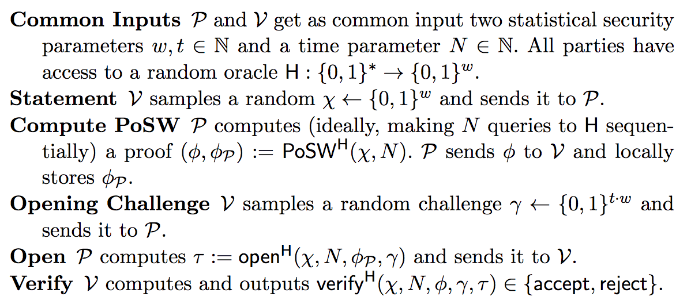
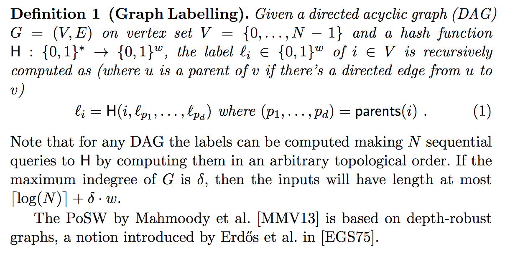

# proof-of-sequential-work
Small repo for implementing the 2018 EUROCRYPT paper ["Simple Proofs of Sequential Work" by Cohen and Pietrzak](https://eprint.iacr.org/2018/183.pdf). Also used as part of our CS244 project in Professor Kung's class at Harvard University.

This is currently a __experimental__ repository. 

__DO NOT USE THE CURRENT VERSION OF THIS REPO IN ANY REAL WORLD PROGRAM__.

I repeat

__DO NOT USE THE CURRENT VERSION OF THIS REPO IN ANY REAL WORLD PROGRAM__.

This is used as a proof of concept before we implement the scheme with 
cryptographically secure primitives, possibly in a different programming language. 
Also you really shouldn't be running a random persons repository that
probably has crippling security vulnerabilities anyway...

## Usage

__Python 3.6 is REQUIRED to run this code using your computer's entropy source__. 
This is because we use the `secrets` module first introduced in Python 3.6 to 
get better random numbers than python's old `random` library.  


Most of the scheme is implemented in ```scheme.py``` and the main functions for 
the prover and the verifier are listed in ```posw.py``` that can be imported
for use in other areas. You can run a small test by running 
```python3 posw.py``` 
which should return true. The file simulates running the scheme for an honest 
prover and verifier. 

Install the python requirements with 
```
pip install -r requirements.txt
```
Then, you can run a simple test with 
```
python3 posw.py --help
usage: posw.py [-h] [-n N] [-t T]

Runs a test prover-verifier proof of sequential work assuming both parties are
honest.

optional arguments:
  -h, --help  show this help message and exit
  -n N        depth of the DAG
  -t T        number of challenges in gamma
```
Parameter selection is important. Try not to go over 20 for n, t can be anywhere from 0 to 2^n and it works fine.
## Parameters 

The parameters described in the paper (and are named in the same way in the source code) are
* __N__: The time parameter which we assume is of the form
    2^n-1 for an integer n
* __w__: A statistical security parameter from which the random nonce is generated from
* __H__: A random oracle (we used default of sha256) that maps (0, 1)* to (0, 1)^w

## Scheme
The scheme is described in the paper as 



The DAG used for the scheme is also constructed with specifications



## Acknowledgements
Many thanks to Professor Kung for his intellectually interesting discussions, as well as Marcus Comiter for all the help in the class. 


## Papers and Further Links

* [Balloon Hashing](https://eprint.iacr.org/2016/027.pdf) Dan Boneh, Henry Corrigan-Gibbs, and Stuart Schechter. A Memory-Hard Function Providing Provable Protection Against Sequential Attacks

* [Publicly Verifiable Proofs of Sequential Work](https://eprint.iacr.org/2011/553.pdf) The earlier paper that this repository is based on, by Professor Salil Vadhan.

* [Simple Proofs of Sequential Work](https://eprint.iacr.org/2018/183.pdf) The paper that this repository is based on. Was presented in Eurocrypt 2018.

